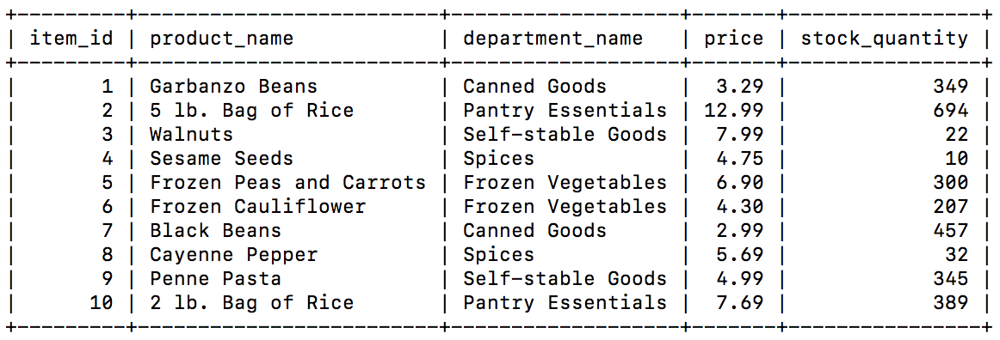

## Command line shop

This is a command line shop that communicates with a MySQL database. Choose the ID of the item that you would like to purchase through the command line prompt and then choose the quantity of the item you would like to purchase. The following is a snapshot of the small database that I am using:

Here is the application in action:

This was created during the UC Davis Extension coding bootcamp.

### Technologies Used

JavaScript, Node NPM packages Inquirer and MySQL, SQL

### Challenges 

1. I initially struggled with understanding the relationship between the database and the JavaScript file that I was working off of. In this, I mean that I had to wrap my head around how the computer would differentiate between the MySQL alternations and calls, and strings. But it was evident that there was a direct relationship between the connection query and the modification of the database. Unlike working with APIs and then manipulating the JSON data, I would have to query the database multiple times if I needed to. 