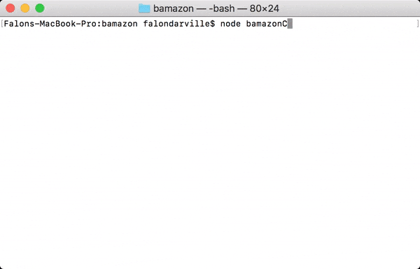
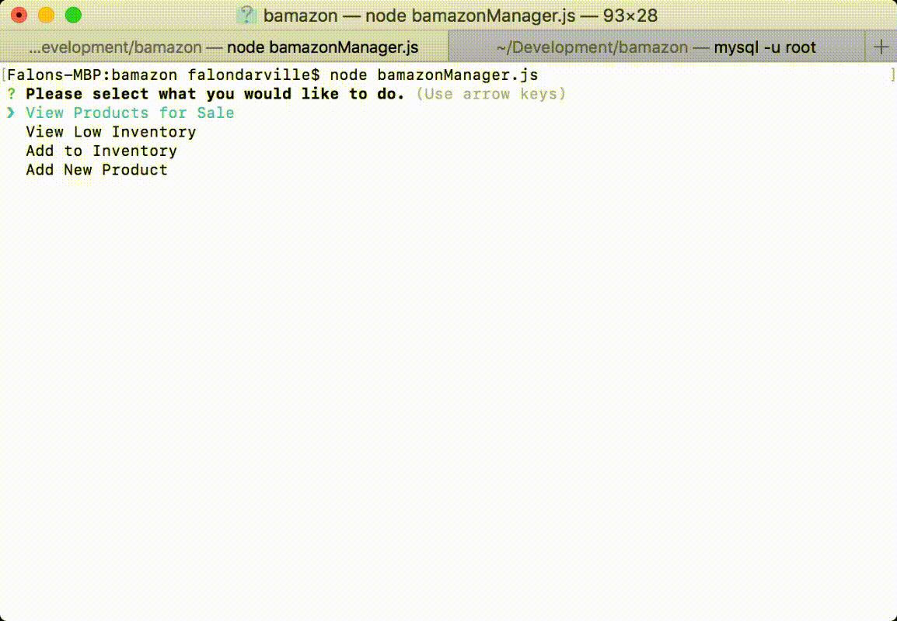

## Command line shop

This is a command line shop with three views that communicates with a MySQL database. There are three files that allow three different shop access levels. These are customer, manager, and supervisor. 

### Store Customer Usage

The following is a view of the customer view of the application. Here, we see the customer choosing the ID of the item he or she would like to purchase. Next, he or she is prompted to provide the quantity of that item that they would like to purchase. Presented below are three outcomes:

1. The customer chose an item ID that existed in the database. In this case, you will see that the prompt encourages the customer to choose a number from 1 through 10 (although the table has since expanded to include more IDs). Given that the quantity that the customer wanted was not exceeding the stock quantity in the database, the transaction went through and the total price for his or her purchase is listed.

2. In this second scenario, the customer chose the item ID for a product that did not live in the table at the time. She was notified that the product did not exist. 

3. In this final case, the customer requested a quantity for an existing product that there was not sufficient stock of to fulfill the order. 

### Store Manager Usage

The manager view has four capabilities, and the command is chosen from a menu. He or she can perform the following:

1. View Products for Sale: Here the manager will receive a list of all of the products available.

2. View Low Inventory: Here the manager will retrieve a list of items with stock less than 5. When there are no items with low stock, the manager will also be notified.  

3. Add to Inventory: With this option, the manager has the ability to add inventory to an existing item in the products table. He or she will be prompted to select the item that he or she wants to replenish and then type in the amount to be added. 

4. Add New Product: This final option allows the manager to add a new product to the inventory. The manager is prompted to enter the name of the product, department to which it belongs, unit price, and number of units in stock.

### Store Supervisor Usage

The store supervisor has two capabilities, selected from the prompt menu that appears when entering this mode. 

1. View Product Sales By Department: With this view, the supervisor sees an overview report containing the department id, department name, overhead costs, sales in each department, and difference between the overhead costs and department sales. 

2. Create New Department: With this option, the supervisor can create a new department by entering the department name and overhead costs. 

### Technologies Used

JavaScript, Node NPM packages Inquirer and MySQL, SQL

### Challenges 

I initially struggled with understanding the relationship between the database and the JavaScript file that I was working off of. In this, I mean that I had to wrap my head around how the computer would differentiate between the MySQL alternations and calls, and strings. But it was evident that there was a direct relationship between the connection query and the modification of the database. Unlike working with APIs and then manipulating the JSON data, I would have to query the database multiple times if I needed to. 

This was created during the UC Davis Extension coding bootcamp.